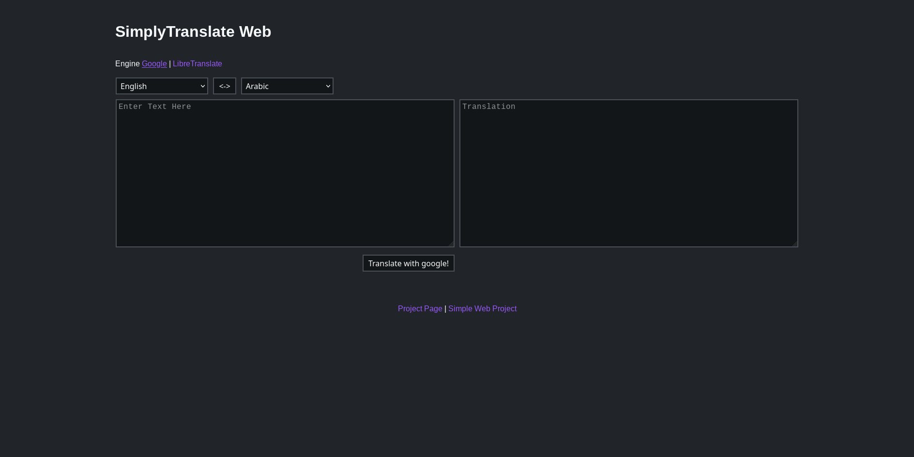

# SimplyTranslate GO
An alternative front-end to GoogleTranslate, LibreTranslate



## Install
### Install [GO-lang](https://golang.org/)
```
$ sudo apt install golang
```

### Clone the [repo](https://github.com/ManeraKai/simplytranslate_go)
```
$ cd /var/www/

$ git clone https://github.com/ManeraKai/simplytranslate_go.git
```

### Compile it with [GO-lang](https://golang.org/)

```
$ cd simplytranslate_go/web/
```

This will compile an executable called `simplytranslate_web`
```
$ go build
```

### Running it
```
$ ./simplytranslate_web
```

### Running it at startup with systemd
```
$ sudo apt install wget

$ cd /etc/systemd/system/

$ wget https://raw.githubusercontent.com/ManeraKai/simplytranslate_go/master/docs/simplytranslate_go.service

$ systemd daemon-reload

$ systemd enable simplytranslate_go.service
```