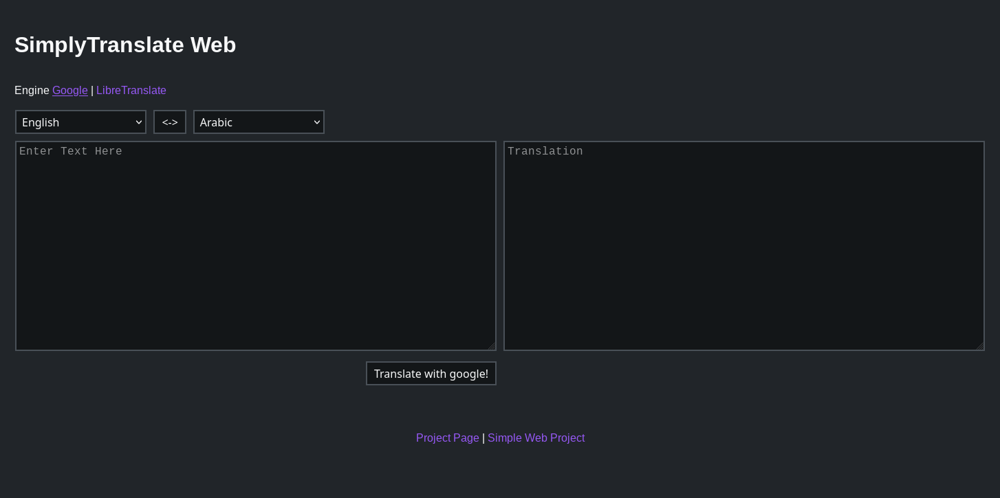

# SimplyTranslate GO
An alternative front-end to GoogleTranslate, LibreTranslate



## Install (Ubuntu Server)
### 1. Install [golang](https://golang.org/)
```
$ sudo apt install golang
```

### 2. Clone the Repository
```
$ cd /var/

$ sudo git clone https://github.com/ManeraKai/simplytranslate_go.git
```

### 3. Compile it with [golang](https://golang.org/)
```
$ cd simplytranslate_go/web/
```
This will compile an executable called `simplytranslate_web`
```
$ sudo go build
```

## Running it
```
$ ./simplytranslate_web
```

### Running it at startup with systemd
```
$ cd /etc/systemd/system/

$ sudo wget https://raw.githubusercontent.com/ManeraKai/simplytranslate_go/master/docs/simplytranslate_go.service

$ sudo systemctl daemon-reload

$ sudo systemctl enable simplytranslate_go.service

$ sudo systemctl start simplytranslate_go
```