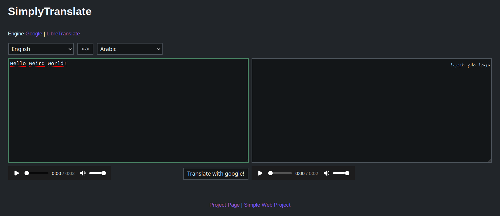

# SimplyTranslate GO
An alternative front-end to GoogleTranslate, LibreTranslate

This is [SimplyTranslate](https://simplytranslate.org/), but written in [golang](https://golang.org/).



## Install ([Ubuntu Server](https://ubuntu.com/download/server))
### 1. Install [golang](https://golang.org/)
```
$ sudo apt install golang
```

### 2. Clone the Repository to `/var/`
```
$ cd /var/

$ sudo git clone https://github.com/ManeraKai/simplytranslate_go.git
```

### 3. Compile with [golang](https://golang.org/)
It will compile an executable called `simplytranslate_web`
```
$ cd simplytranslate_go/web/

$ sudo go build
```

## Config
Copy the config file `web.yaml` with the default settings to this path `/etc/simplytranslate_go/`
 
```
$ sudo mkdir /etc/simplytranslate_go/

$ cd /etc/simplytranslate_go/

$ sudo cp /var/simplytranslate_go/docs/web.yaml ./
```
You can edit it with nano
```
$ sudo nano web.yaml
```

## Running it
```
$ cd /var/simplytranslate_go/web/

$ ./simplytranslate_web
```

### Auto running it at startup with systemd
This `.service` file runs the executable in `/etc/simplytranslate_go/`
```
$ cd /etc/systemd/system/

$ sudo cp /var/simplytranslate_go/docs/simplytranslate_go.service ./

$ sudo systemctl daemon-reload 
```

To enable the service
```
$ sudo systemctl enable simplytranslate_go.service

$ sudo systemctl start simplytranslate_go
```
To check if there's any errors 
```
$ systemctl status simplytranslate_go
```

## Updating it
```
$ cd /var/simplytranslate_go

$ sudo git pull

$ cd web/

$ sudo go build
```
Be sure to check if there's any changes in the config files in [`/etc/simplytranslate_go/`](./docs)

To restart it with systemd
```
sudo systemctl restart simplytranslate_go
```

## Mirror Repos
[](https://github.com/ManeraKai/simplytranslate_go)&nbsp;&nbsp;
[](https://codeberg.org/ManeraKai/simplytranslate_go)&nbsp;&nbsp;

## License
[GNU Affero General Public License](./LICENSE)
